# Introdução

* **Projeto:** Plataforma de Estudos - Plataforma web para apoiar alunos e professores
* **Repositório GitHub:** (https://github.com/gustavonmsouza/plataforma-estudos-ti2)
* **Membros da equipe:**
  
  * [Gabriela Schaper Soriano Veiga] (https://github.com/GabiScha)
  * [Gustavo Norberto Medeiros de Souza] (https://github.com/gustavonmsouza)
  * [Lucas Marçal Vilela]
  * [Matheus Romling Rotheia Almeida] (https://github.com/Matheus-Romling)
  * [Renato Teixeira Miranda Guimarães] (https://github.com/Servor234)

Este documento acompanha a evolução do projeto ao longo das duas fases da disciplina: primeiro a fase de **Estratégia**, guiada pelo Design Thinking, em que entendemos o problema e projetamos a solução; depois a fase de **Implementação**, guiada pelo Scrum, em que construímos a aplicação ao longo de três sprints.

## Sumário

1. [Contexto](#contexto)
   * [Problema](#problema) · [Objetivos](#objetivos) · [Justificativa](#justificativa) · [Público-Alvo](#público-alvo)
2. [Product Discovery](#product-discovery)
   * [Mapa de Stakeholders](#mapa-de-stakeholders) · [Matriz CSD](#matriz-csd) · [Pesquisa de Campo](#pesquisa-de-campo) · [Personas](#personas)
3. [Product Design](#product-design)
   * [Proposta de Valor](#proposta-de-valor) · [Histórias de Usuários](#histórias-de-usuários) · [Requisitos](#requisitos) · [User Story Map e Definição do MVP](#user-story-map-e-definição-do-mvp) · [Projeto de Interface](#projeto-de-interface)
4. [Metodologia](#metodologia)
   * [Ferramentas](#ferramentas) · [Gerenciamento do Projeto](#gerenciamento-do-projeto)
5. [Solução Implementada](#solução-implementada)
   * [Vídeo do Projeto](#vídeo-do-projeto) · [Funcionalidades](#funcionalidades) · [Minimundo](#minimundo) · [Estruturas de Dados](#estruturas-de-dados) · [Módulos e APIs](#módulos-e-apis)
6. [Referências](#referências)

---

# Contexto

Detalhes sobre o espaço de problema, os objetivos do projeto, sua justificativa e público-alvo.

## Problema

A falta de motivação e de sentido nos estudos pode afetar o interesse e o envolvimento dos estudantes brasileiros com a educação. Esse cenário pode estar relacionado a dificuldades em manter a concentração, ao interesse pelas atividades propostas e à percepção da relação entre os conteúdos estudados e os objetivos futuros.

Diante disso, o problema de pesquisa pode ser definido pela seguinte questão:

**Como aumentar a motivação e o sentido dos estudantes brasileiros em relação aos estudos?**

## Objetivos

**Objetivo geral**

Desenvolver um software que contribua para tornar a experiência educacional mais atrativa e estimular o envolvimento dos estudantes com os estudos.

**Objetivos específicos**

- Identificar fatores que influenciam o interesse, a concentração e o envolvimento dos estudantes com os estudos.
- Compreender as necessidades e dificuldades dos estudantes durante a experiência educacional.
- Propor formas de tornar as atividades de aprendizagem mais atrativas e estimular a participação dos estudantes.
  
## Justificativa

A escolha do tema está relacionada à necessidade de compreender as dificuldades enfrentadas pelos estudantes durante sua experiência educacional. As entrevistas realizadas pelo grupo apontaram diferentes situações relacionadas ao interesse, à concentração e à forma como os estudantes se relacionam com as atividades de aprendizagem. Também foram identificadas preferências por atividades mais dinâmicas, interativas e diferentes das abordagens tradicionais.

Durante as entrevistas, foram mencionados recursos como jogos, quizzes e atividades lúdicas como formas de tornar os momentos de aprendizagem mais interessantes e favorecer a participação dos estudantes. Também foram identificadas dificuldades relacionadas à concentração, à realização dos estudos e à percepção da relação entre os conteúdos estudados e os objetivos futuros.

Diante dessas observações, os objetivos específicos foram definidos para compreender melhor os fatores que influenciam o envolvimento dos estudantes e suas necessidades durante o processo educacional. A partir dessa investigação, busca-se propor formas de tornar a experiência de aprendizagem mais atrativa e estimular a participação dos estudantes.

## Público-Alvo

O público-alvo da aplicação é formado principalmente por **estudantes e professores**, com perfis e necessidades diferentes dentro do ambiente educacional.

Os **estudantes** são usuários que utilizam a plataforma para apoiar sua rotina de estudos e acompanhar seu desenvolvimento. Entre os perfis identificados estão estudantes que apresentam dificuldades relacionadas à concentração, ao início e à continuidade dos estudos e ao interesse pelas atividades. Também foram identificadas preferências por atividades mais dinâmicas, interativas e lúdicas.

Os **professores** são responsáveis pelo acompanhamento das atividades educacionais e possuem necessidades relacionadas à organização de suas turmas, ao planejamento e ao acompanhamento dos estudantes. A pesquisa identificou a necessidade de facilitar a criação de atividades e tornar as aulas mais interessantes para os alunos.

No projeto, esses perfis foram representados pelas personas **Lucas**, **Maria** e **Bernardo**, que apresentam diferentes características, necessidades, preferências e dificuldades relacionadas ao contexto educacional. Lucas e Bernardo representam perfis de estudantes, enquanto Maria representa o perfil de professora.

# Product Discovery

Nesta etapa, aprofundamos a compreensão do problema escolhido a partir da perspectiva de quem o vivencia. O grupo levanta evidências de campo — não suposições — e as converte em artefatos que sustentam as decisões de produto tomadas na etapa de Product Design.

## Mapa de Stakeholders

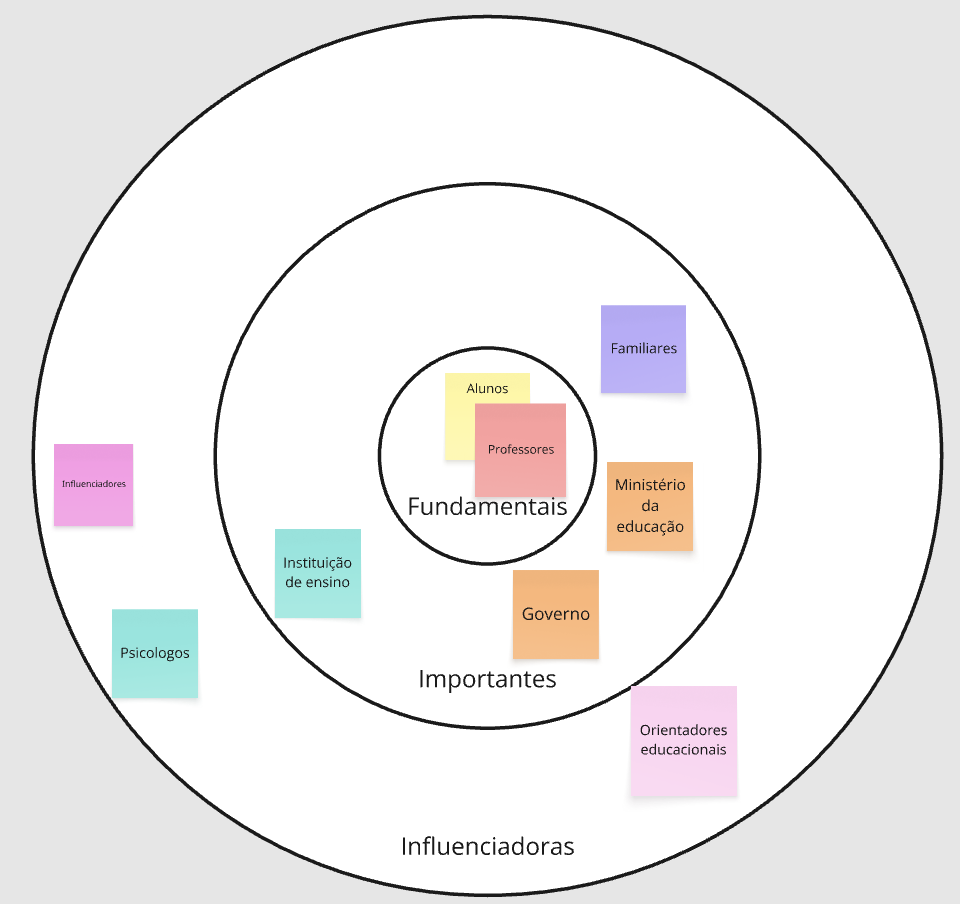

## Matriz CSD

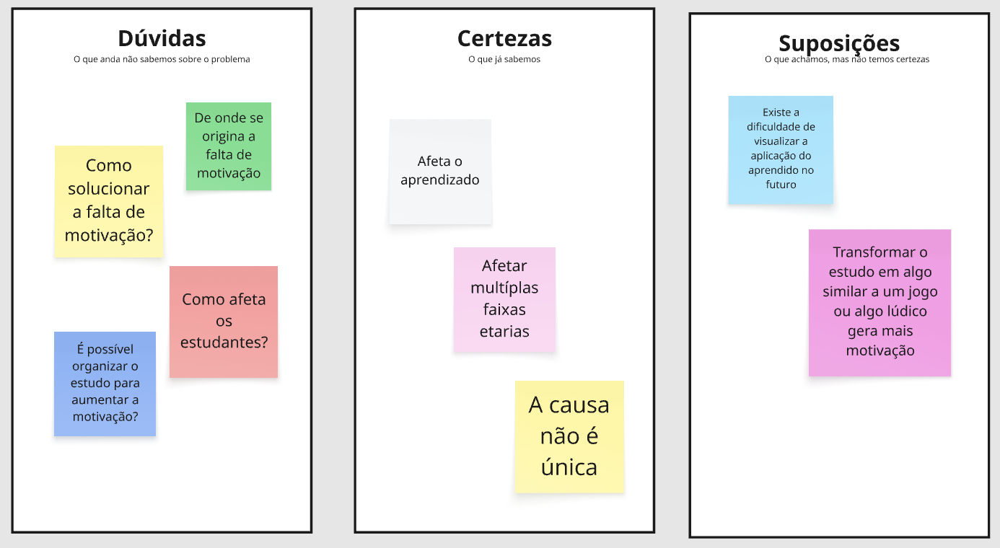

## Pesquisa de Campo

### Roteiro de Entrevistas

<table>
  <tr>
    <td>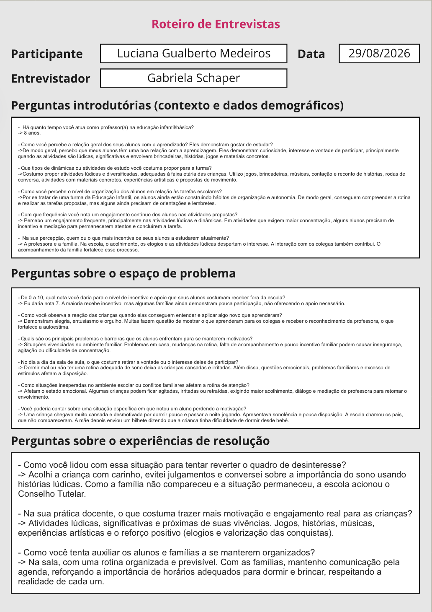</td>
    <td>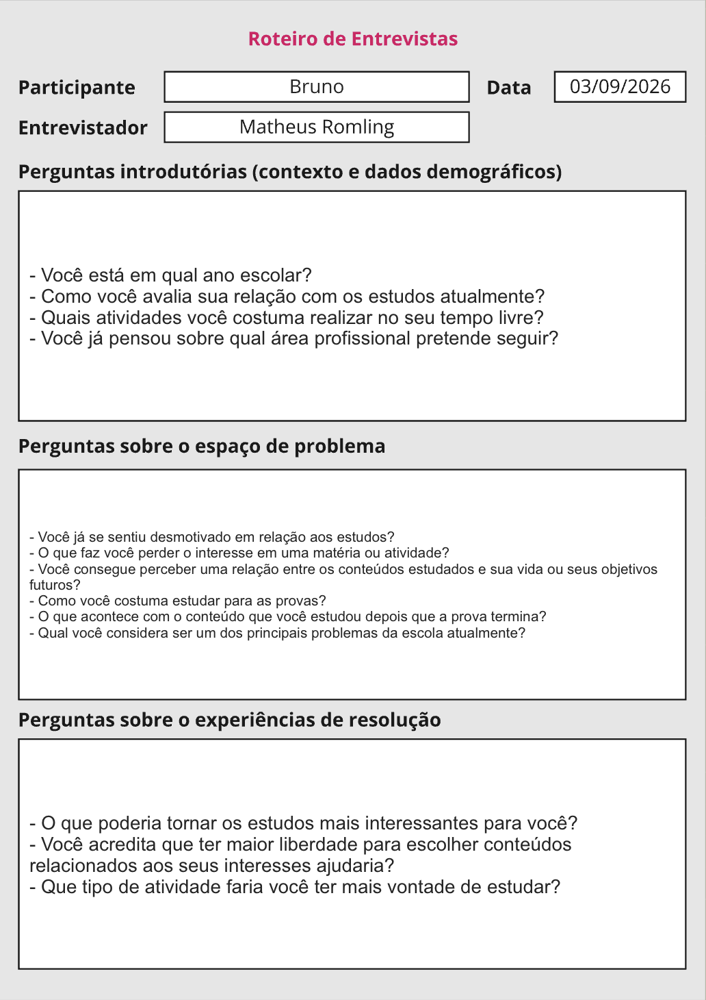</td>
  </tr>
  <tr>
    <td>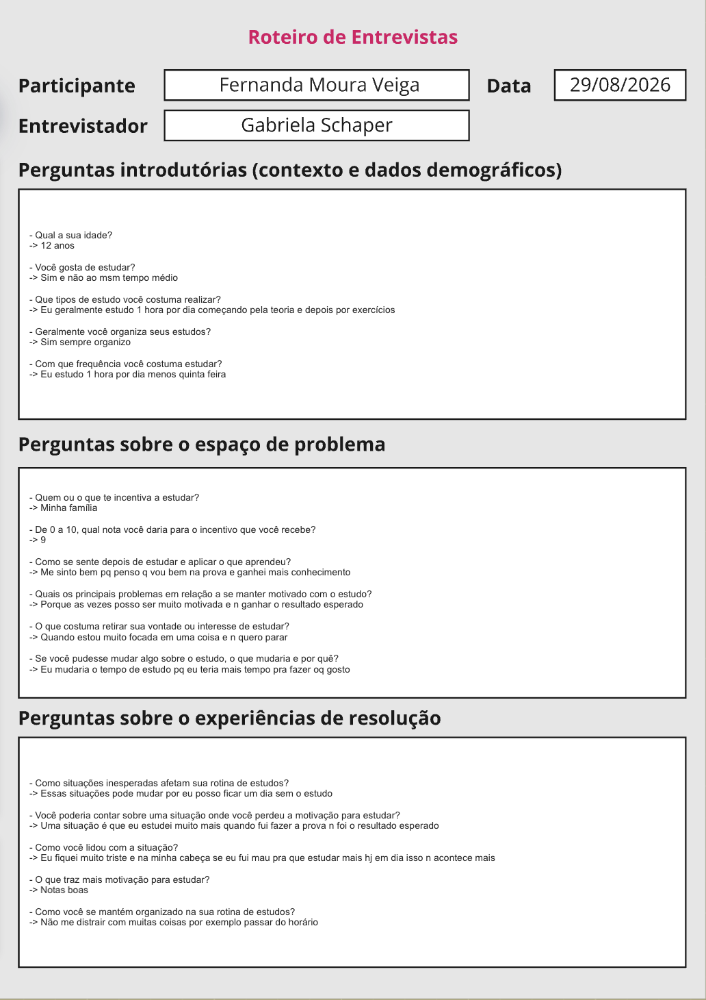</td>
    <td>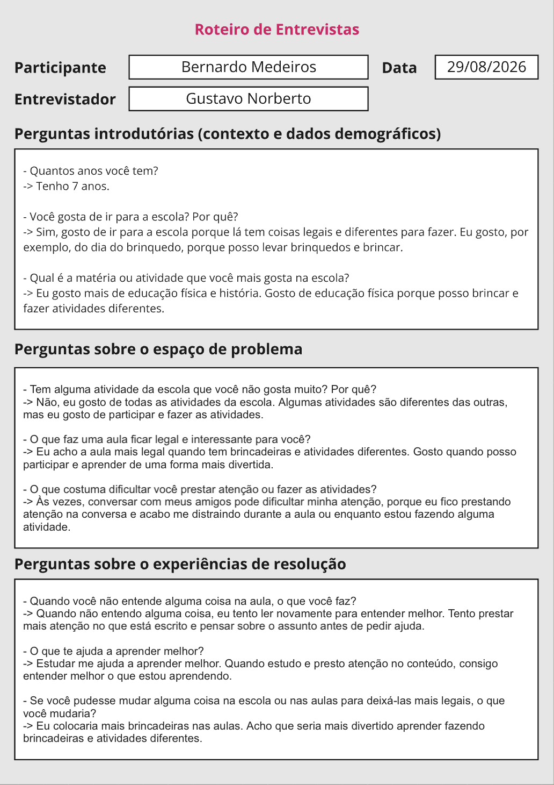</td>
  </tr>
</table>

### Entrevistados

| Entrevistado | Perfil |
|---|---|
| Luciana Gualberto Medeiros | Professora |
| Fernanda Moura Veiga | Estudante |
| Bernardo Medeiros | Estudante |
| Bruno | Estudante |

### Highlights da Pesquisa

<table>
  <tr>
    <td>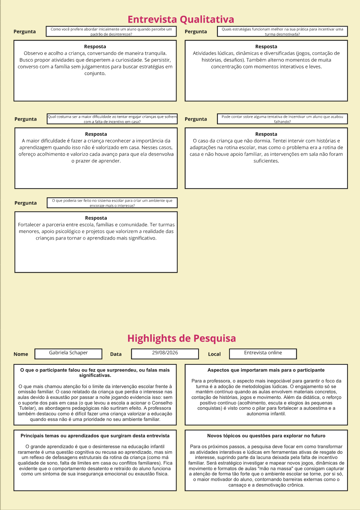</td>
    <td>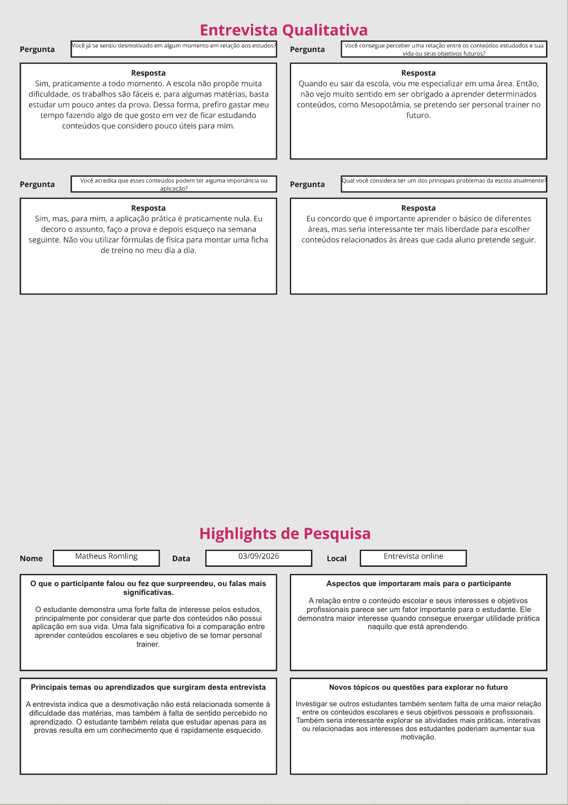</td>
  </tr>
  <tr>
    <td>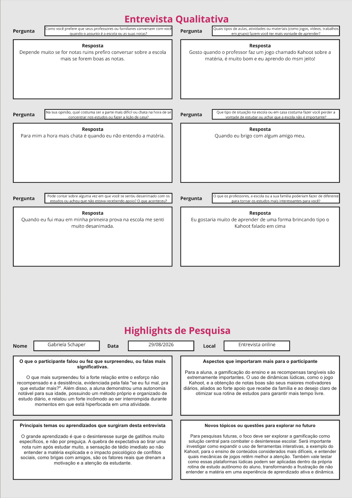</td>
    <td>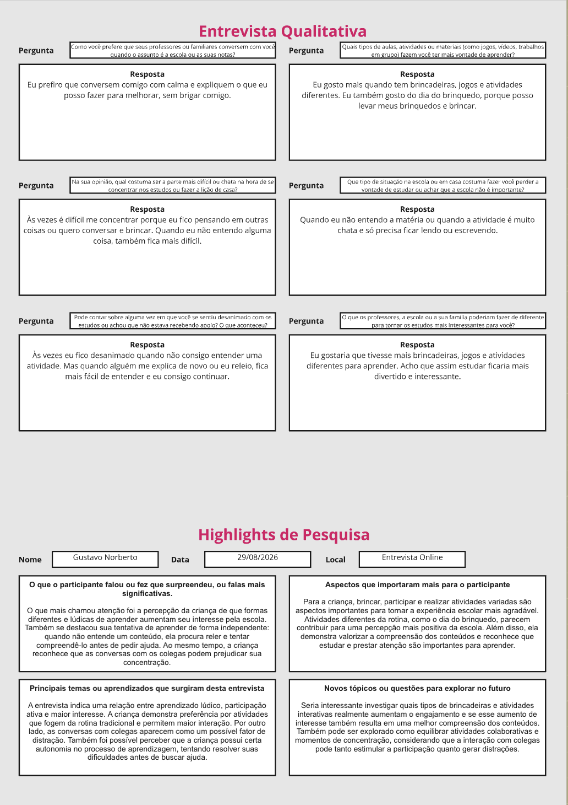</td>
  </tr>
</table>

## Personas

As personas foram construídas a partir dos resultados obtidos na pesquisa de campo e representam diferentes perfis relacionados ao contexto educacional.

### Lucas

Lucas tem 15 anos, é estudante do ensino médio e mora em Belo Horizonte. Está passando por uma etapa escolar mais exigente e precisa dedicar mais tempo aos estudos, mas encontra dificuldades para conciliar essa rotina com outras atividades.

Entre suas principais dificuldades estão a concentração, o início dos estudos e a permanência em uma determinada matéria. Seu objetivo é conseguir se concentrar melhor, estudar de forma mais eficiente e manter uma rotina de estudos. Lucas demonstra interesse por uma ferramenta que auxilie na organização dos estudos, especialmente por meio de um temporizador.

### Maria

Maria tem 50 anos, é professora do ensino fundamental e mora em Belo Horizonte. Possui 26 anos de experiência na área da educação e busca promover a aprendizagem e uma maior participação dos alunos.

Entre seus principais desafios estão atrair e manter o interesse dos estudantes, criar aulas interessantes e organizar seu calendário. Seus objetivos incluem cumprir sua programação, aumentar o interesse dos alunos e criar novos materiais para suas aulas. Maria demonstra interesse por recursos que possibilitem atividades interativas e novas formas de trabalhar os conteúdos.

### Bernardo

Bernardo tem 7 anos, é estudante do ensino fundamental e mora em Belo Horizonte com sua família. Gosta da escola, especialmente de atividades diferentes, e demonstra interesse por aprender por meio de jogos e brincadeiras.

Entre suas principais dificuldades estão manter a concentração, iniciar os estudos e manter o interesse nas aulas. Seus objetivos são melhorar a concentração, aumentar a eficiência nos estudos e manter uma rotina de aprendizagem. Bernardo demonstra preferência por atividades mais divertidas e jogos educativos.

### Diagramas das Personas

<table>

  <tr>
    <td align="center">
      <strong>Lucas</strong><br>
      
    </td>
    <td align="center">
      <strong>Maria</strong><br>
      
    </td>
    <td align="center">
      <strong>Bernardo</strong><br>
      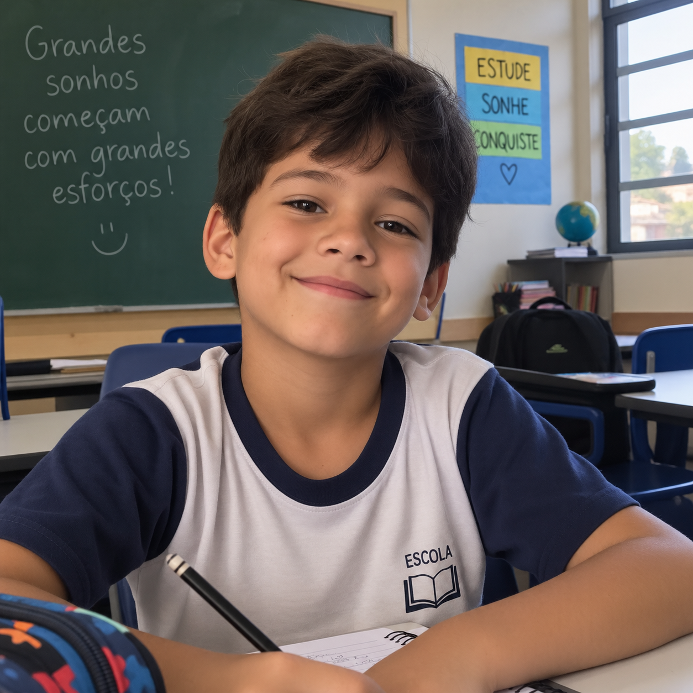
    </td>
  </tr>
</table>

# Product Design

Nesse momento, vamos transformar os insights e validações obtidos em soluções tangíveis e utilizáveis. Essa fase envolve a definição de uma proposta de valor, a redação das histórias de usuário, a organização de tudo em um User Story Map e a criação de wireframes, mockups e protótipos que detalham a interface e a experiência do usuário.

## Proposta de Valor

A proposta de valor foi definida a partir das necessidades, dificuldades e objetivos identificados nas personas. Para cada perfil, foi elaborada uma solução específica, buscando atender às suas principais necessidades dentro do contexto educacional.

### Lucas

Para Lucas, a proposta de valor consiste em um **cronômetro adaptativo**, que permite organizar as sessões de estudo de acordo com sua rotina e dividir o estudo em períodos menores para ajudar a manter a concentração. A solução busca auxiliar o estudante a recuperar o foco, melhorar sua eficiência nos estudos e ter mais tempo para outras atividades.

### Maria

Para Maria, a proposta de valor consiste em um **sistema de atividades interativas**, permitindo a criação de atividades dinâmicas para aumentar a participação e o interesse dos alunos. A solução também facilita a criação de aulas interessantes e contribui para aumentar o foco da turma.

### Bernardo

Para Bernardo, a proposta de valor consiste em um **sistema de jogos educativos**, utilizando jogos para tornar os estudos mais interessantes e aumentar a diversão e o interesse do aluno durante a aprendizagem.

### Diagramas das Propostas de Valor

<table>
  <tr>
    <td align="center">
      <strong>Lucas</strong><br>
      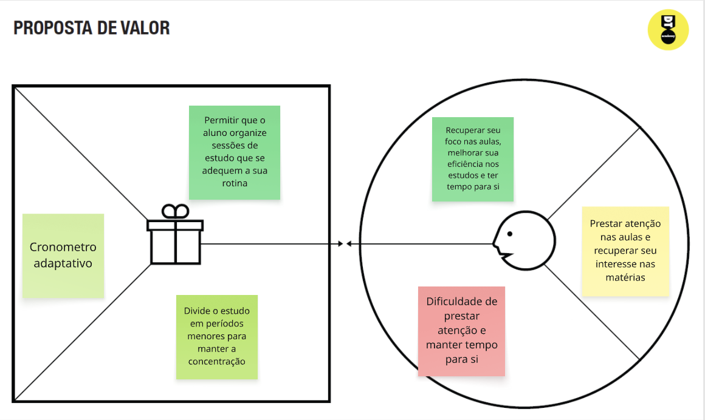
    </td>
    <td align="center">
      <strong>Maria</strong><br>
      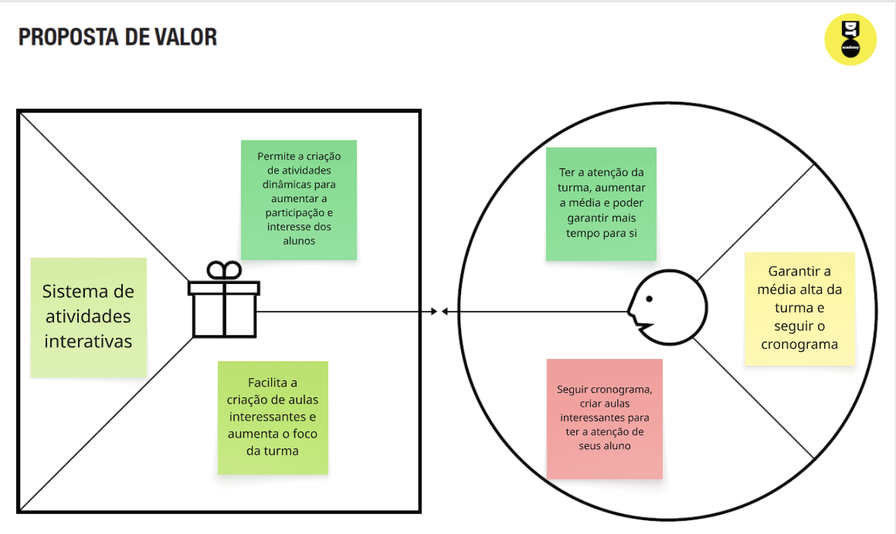
    </td>
    <td align="center">
      <strong>Bernardo</strong><br>
      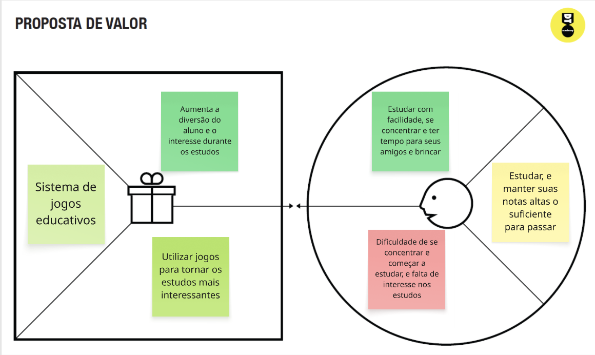
    </td>
  </tr>
</table>

## Histórias de Usuários

Com base na análise das personas, foram identificadas as seguintes histórias de usuário, considerando as necessidades dos estudantes e professores e as funcionalidades propostas para a plataforma.

### Histórias dos Alunos

| EU COMO... PERSONA | QUERO/PRECISO... FUNCIONALIDADE | PARA... MOTIVO/VALOR |
|---|---|---|
| Lucas | Utilizar um cronômetro adaptativo para organizar minhas sessões de estudo | Manter minha concentração e organizar melhor minha rotina de estudos |
| Lucas | Dividir meu tempo de estudo em períodos menores | Facilitar a concentração durante os estudos |
| Lucas | Acompanhar minhas tarefas e atividades | Organizar minha rotina acadêmica e não esquecer minhas responsabilidades |
| Bernardo | Utilizar jogos educativos durante os estudos | Tornar o aprendizado mais divertido e interessante |
| Bernardo | Realizar atividades interativas | Aumentar meu interesse e participação nos estudos |
| Bernardo | Acompanhar meu progresso nos estudos | Perceber minha evolução e manter minha rotina de aprendizagem |

### Histórias dos Professores

| EU COMO... PERSONA | QUERO/PRECISO... FUNCIONALIDADE | PARA... MOTIVO/VALOR |
|---|---|---|
| Maria | Criar atividades interativas para meus alunos | Aumentar a participação e o interesse da turma |
| Maria | Organizar minhas turmas e grupos | Facilitar o gerenciamento dos alunos e das atividades |
| Maria | Acompanhar as tarefas realizadas pelos alunos | Verificar o andamento das atividades da turma |
| Maria | Gerenciar notas dos alunos | Acompanhar o desempenho acadêmico da turma |
| Maria | Organizar minhas atividades em um calendário | Cumprir meu cronograma e facilitar o planejamento das aulas |

## Requisitos

As tabelas que se seguem apresentam os requisitos funcionais e não funcionais que detalham o escopo do projeto.

### Requisitos Funcionais

| ID | Descrição do Requisito | Prioridade |
|---|---|---|
| RF-001 | Permitir que o aluno cadastre e gerencie suas tarefas | ALTA |
| RF-002 | Permitir que o aluno utilize um cronômetro para organizar suas sessões de estudo | ALTA |
| RF-003 | Permitir que o aluno acompanhe seu progresso nos estudos | ALTA |
| RF-004 | Permitir que o aluno participe de atividades interativas e jogos educativos | ALTA |
| RF-005 | Permitir que o aluno acompanhe sua sequência de estudos e conquistas | MÉDIA |
| RF-006 | Permitir que o aluno acumule pontos por meio de suas atividades na plataforma | MÉDIA |
| RF-007 | Permitir que o aluno utilize os pontos acumulados na loja de cosméticos | MÉDIA |
| RF-008 | Permitir que o professor crie atividades interativas | ALTA |
| RF-009 | Permitir que o professor gerencie suas turmas, grupos e tarefas | ALTA |
| RF-010 | Permitir que o professor gerencie as notas dos alunos e organize suas atividades por meio de um calendário | ALTA |

### Requisitos Não Funcionais

| ID | Descrição do Requisito | Prioridade |
|---|---|---|
| RNF-001 | O sistema deve possuir uma interface responsiva, adaptando-se a diferentes tamanhos de tela | ALTA |
| RNF-002 | O sistema deve apresentar uma interface de fácil utilização e compreensão | ALTA |
| RNF-003 | O sistema deve proteger os dados dos usuários contra acesso não autorizado | ALTA |
| RNF-004 | O sistema deve garantir a integridade dos dados armazenados | ALTA |
| RNF-005 | O sistema deve apresentar as funcionalidades de forma consistente nos principais navegadores utilizados | MÉDIA |
| RNF-006 | O sistema deve responder às ações do usuário em tempo adequado, sem atrasos que prejudiquem a utilização da plataforma | MÉDIA |

## User Story Map e Definição do MVP

**✳️✳️✳️ COLOQUE AQUI O SEU USER STORY MAP ✳️✳️✳️**

<details>
<summary>⚠️ Como preencher esta seção (apague antes de entregar)</summary>

O User Story Map organiza todas as histórias de usuário em uma visão única do produto, ordenadas pela jornada do usuário (linha) e pela prioridade (coluna). É a partir dele que o grupo recorta o Produto Mínimo Viável (MVP) e distribui o restante do backlog entre as três sprints da fase de Implementação.

Indique claramente, no seu User Story Map: (1) quais histórias compõem o MVP; (2) em qual sprint (1, 2 ou 3) cada fatia do backlog será desenvolvida.

**Orientações**:

- [User Story Mapping: o que é e como fazer](https://www.atlassian.com/br/agile/project-management/user-story-mapping)

</details>

## Projeto de Interface

Artefatos relacionados com a interface e a interacão do usuário na proposta de solução.

### Wireframes

Estes são os protótipos de telas do sistema.


### Tela Inicial do Aluno

A tela inicial do aluno apresenta uma visão geral da plataforma, reunindo os principais recursos de acompanhamento dos estudos, como turmas, tarefas e notas.

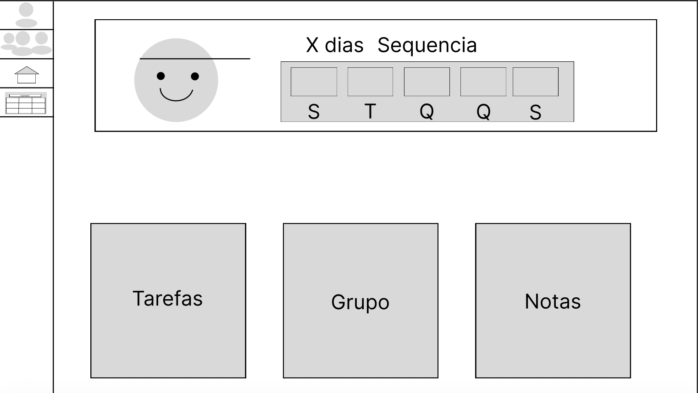

### Tarefas do Aluno

A tela de tarefas permite que o aluno visualize suas tarefas e acompanhe as atividades disponíveis na plataforma.

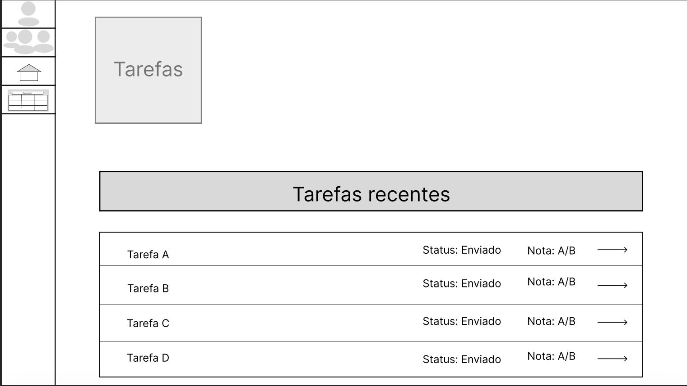

### Calendário

A tela de calendário permite que o aluno visualize suas tarefas e atividades organizadas ao longo do mês.

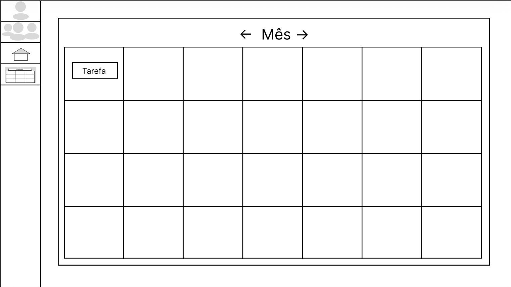

### Perfil do Aluno

A tela de perfil apresenta as informações do aluno, seus pontos e seu progresso nos estudos, incluindo conquistas e sequência de estudos.

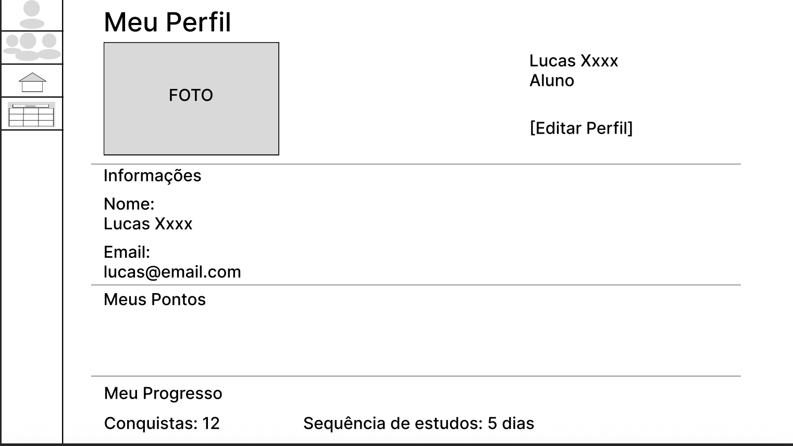

### Loja de Cosméticos

A loja de cosméticos permite que o aluno visualize os produtos disponíveis e utilize seus pontos acumulados para realizar compras.

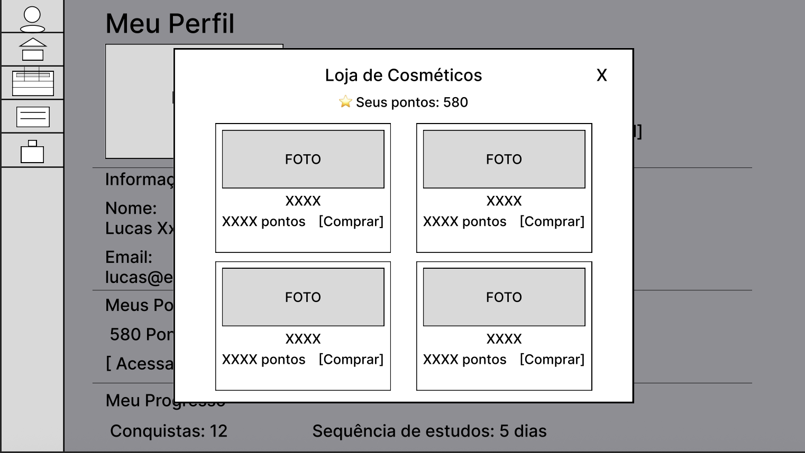

### Tela Inicial do Professor

A tela inicial do professor apresenta as principais funcionalidades disponíveis para o gerenciamento das atividades acadêmicas.

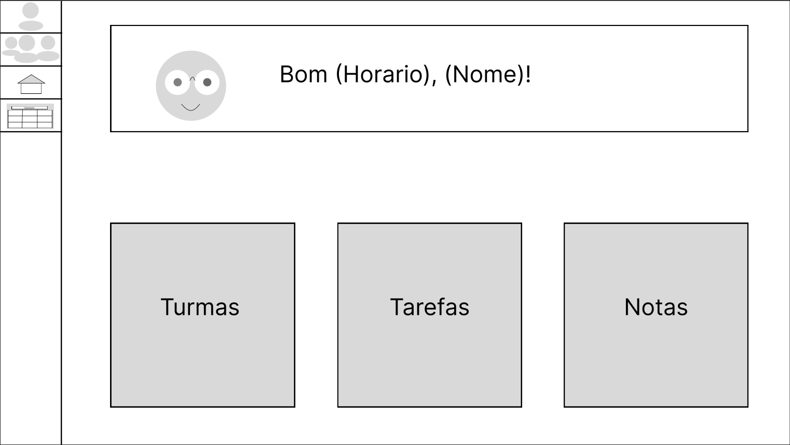

### Gerenciamento de Tarefas

A tela de gerenciamento de tarefas permite que o professor visualize e organize as tarefas disponíveis para seus alunos.

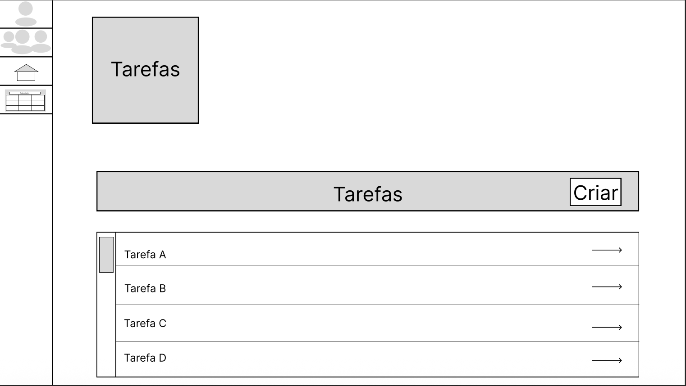

### Gerenciamento de Turmas

A tela de gerenciamento de turmas permite que o professor visualize e organize suas turmas, grupos e alunos.

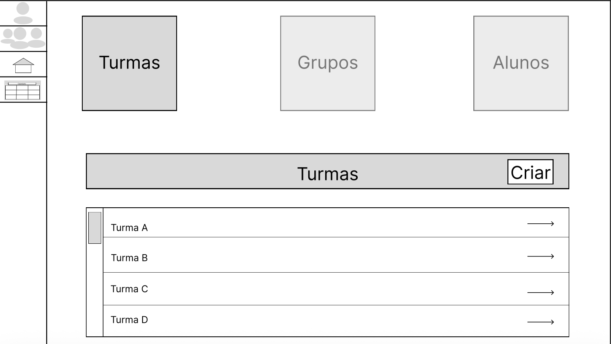

### Perfil do Professor

A tela de perfil apresenta as informações do professor, sua disciplina e as opções relacionadas ao gerenciamento de seu perfil.

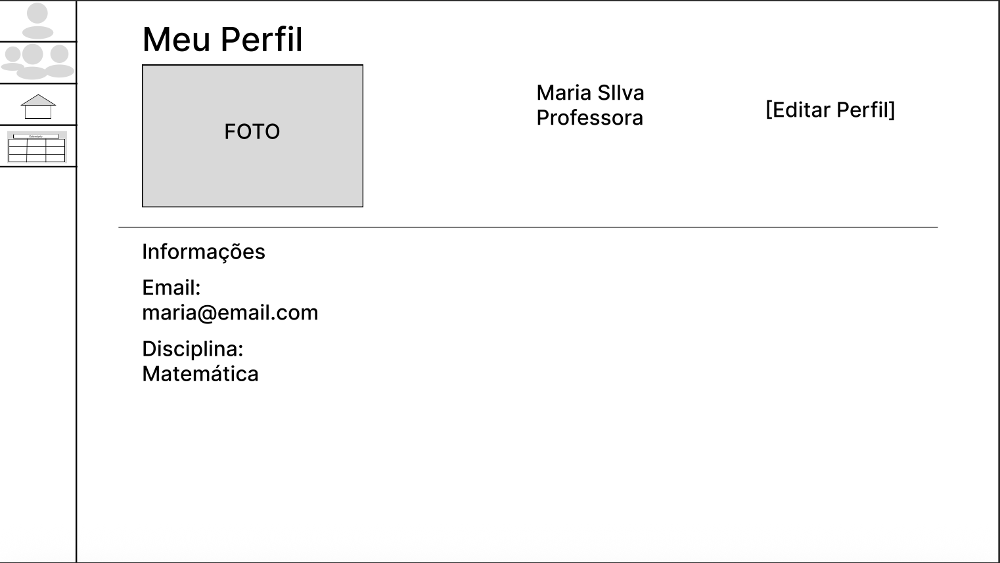

### User Flow

O User Flow foi desenvolvido para representar os caminhos de navegação entre as principais telas da plataforma, considerando os diferentes perfis de usuário e suas respectivas funcionalidades.

O fluxo completo das telas está disponível no documento abaixo:

[User Flow - Grupo 3](files/User%20flow%20-%20Grupo%203.pdf)

### Protótipo Interativo

[Protótipo Interativo (Figma)](https://www.figma.com/proto/PBYQ3M8zL87PrhYOtnMJXT/Trabalho-TI?node-id=1-2910&starting-point-node-id=1%3A2910)

---

# Metodologia

Detalhes sobre a organização do grupo e o ferramental empregado.

## Ferramentas

Relação de ferramentas empregadas pelo grupo durante o projeto.

| Ambiente | Plataforma | Link de acesso |
|---|---|---|
| Processo de Design Thinking | Miro | https://miro.com/app/board/uXjVHwGwjH8=/?share_link_id=452109942937 |
| Quadro Kanban | Miro | https://miro.com/welcomeonboard/YVVjbnFqb2g2QTNNSzJ2eXBIVnpFMk1FNHpiQXRPM3lsQkVyNTduMXVrQ0NpKzR2ZVR0SHRmS1BvTlpiMGxJWUo4cExMUVViMGxyOVBMRjJqMjMyMEF2YnVnZCs1VXlyZ2YzTlZUVVRSK1YyZmFZR3RVNThMWjFGRnRBSk5PM3ZzVXVvMm53MW9OWFg5bkJoVXZxdFhRPT0hdjE=?share_link_id=653180971446 |
| Repositório do projeto | GitHub | https://github.com/gustavonmsouza/plataforma-estudos-ti2 |
| Protótipo Interativo | Figma | https://www.figma.com/design/PBYQ3M8zL87PrhYOtnMJXT |
| Apresentação | Canva | https://canva.link/s2m1mu4zdctrf72 |

## Gerenciamento do Projeto

O grupo adotou uma metodologia de trabalho baseada no **Scrum**, utilizando um quadro **Kanban** para auxiliar no gerenciamento e acompanhamento das tarefas. A equipe foi organizada de forma auto-organizada, com a divisão de funções entre os integrantes.

### Divisão de Papéis

- **Product Owner:** Gabriela Schaper
- **Scrum Master:** Matheus Romling
- **Desenvolvedor — foco em artes:** Gustavo Norberto
- **Desenvolvedor — foco em organização:** Renato Teixeira
- **Desenvolvedor — foco em código:** Lucas Marçal

As atividades foram subdivididas em tarefas menores, que foram distribuídas entre os integrantes da equipe. Também foram realizadas reuniões semanais de realinhamento para acompanhar o andamento do projeto e garantir uma distribuição equilibrada das atividades.

### Ferramentas de Gerenciamento

O **Miro** foi utilizado como espaço principal de organização do trabalho e para o acompanhamento das tarefas por meio do quadro Kanban.

O **Figma** foi utilizado para a criação dos wireframes, desenvolvimento do User Flow e elaboração do protótipo funcional da aplicação.

O **Chat GPT** foi utilizado na criação das imagens das personas.

O **Canva** foi utilizado para a elaboração da apresentação do trabalho e exposição dos resultados desenvolvidos.

O **GitHub** foi utilizado como repositório para organização e armazenamento dos principais artefatos produzidos durante o projeto.

---

# Solução Implementada

Esta seção apresenta todos os detalhes da solução criada no projeto.

## Vídeo do Projeto

O vídeo a seguir traz uma apresentação do problema que a equipe está tratando e a proposta de solução. ⚠️ EXEMPLO ⚠️

[](https://www.youtube.com/embed/70gGoFyGeqQ)

<details>
<summary>⚠️ Como preencher esta seção (apague antes de entregar)</summary>

O vídeo de apresentação é voltado para que o público externo possa conhecer a solução. O formato é livre, sendo importante que seja apresentado o problema e a solução numa linguagem descomplicada e direta. Inclua um link para o vídeo do projeto.

</details>

## Funcionalidades

Esta seção apresenta as funcionalidades da solução.

### Funcionalidade 1 - Cadastro de Contatos ⚠️ EXEMPLO ⚠️

Permite a inclusão, leitura, alteração e exclusão de contatos para o sistema

* **Estrutura de dados:** Contatos
* **Instruções de acesso:**
  * Abra o site e efetue o login
  * Acesse o menu principal e escolha a opção Cadastros
  * Em seguida, escolha a opção Contatos
* **Tela da funcionalidade**:


<details>
<summary>⚠️ Como preencher esta seção (apague antes de entregar)</summary>

Apresente cada uma das funcionalidades que a aplicação fornece tanto para os usuários quanto aos administradores da solução.

Inclua, para cada funcionalidade, itens como: (1) título e descrição da funcionalidade; (2) estrutura de dados associada; (3) instruções de acesso e uso.

</details>

## Minimundo

**✳️✳️✳️ DESCREVA AQUI O MINIMUNDO DO SEU NEGÓCIO ✳️✳️✳️**

<details>
<summary>⚠️ Como preencher esta seção (apague antes de entregar)</summary>

O minimundo é uma descrição textual do negócio por trás da sua aplicação: quais são as principais entidades envolvidas (por exemplo, usuários, produtos, pedidos), como elas se relacionam entre si e quais regras de negócio existem. É a partir dessa descrição que o grupo desenha o modelo de dados apresentado na seção seguinte.

</details>

## Estruturas de Dados

Descrição das estruturas de dados utilizadas na solução, com exemplos no formato JSON. No projeto, os dados ficam armazenados no arquivo `codigo/db/db.json` e são servidos automaticamente pelo **JSON Server**: cada chave de nível superior desse arquivo vira uma coleção com sua própria API RESTful (`GET`, `POST`, `PUT`, `DELETE`), sem que seja necessário programar um banco de dados à parte.

### Estrutura de Dados - Contatos ⚠️ EXEMPLO ⚠️

Contatos da aplicação

```json
{
  "id": 1,
  "nome": "Leanne Graham",
  "cidade": "Belo Horizonte",
  "categoria": "amigos",
  "email": "Sincere@april.biz",
  "telefone": "1-770-736-8031",
  "website": "hildegard.org"
}
```

### Estrutura de Dados - Usuários ⚠️ EXEMPLO ⚠️

Registro dos usuários do sistema, utilizado para login e para o perfil do sistema

```json
{
  "id": 1,
  "login": "admin",
  "senha": "123",
  "nome": "Administrador do Sistema",
  "email": "admin@abc.com"
}
```

<details>
<summary>⚠️ Como preencher esta seção (apague antes de entregar)</summary>

Apresente as estruturas de dados utilizadas na solução, tanto para os dados que fazem parte da essência da aplicação quanto outras estruturas criadas para algum tipo de configuração. Nomeie a estrutura, coloque uma descrição sucinta e apresente um exemplo em formato JSON correspondente a uma das coleções do `db.json`.

**Orientações:**

- [JSON Introduction](https://www.w3schools.com/js/js_json_intro.asp)
- [Trabalhando com JSON - Aprendendo desenvolvimento web | MDN](https://developer.mozilla.org/pt-BR/docs/Learn/JavaScript/Objects/JSON)

</details>

## Módulos e APIs

Esta seção apresenta os módulos e APIs utilizados na solução.

**Images**:

* Unsplash - [https://unsplash.com/](https://unsplash.com/) ⚠️ EXEMPLO ⚠️

**Fonts:**

* Icons Font Face - [https://fontawesome.com/](https://fontawesome.com/) ⚠️ EXEMPLO ⚠️

**Scripts:**

* jQuery - [http://www.jquery.com/](http://www.jquery.com/) ⚠️ EXEMPLO ⚠️
* Bootstrap 4 - [http://getbootstrap.com/](http://getbootstrap.com/) ⚠️ EXEMPLO ⚠️

<details>
<summary>⚠️ Como preencher esta seção (apague antes de entregar)</summary>

Apresente os módulos e APIs utilizados no desenvolvimento da solução. Inclua itens como: (1) frameworks, bibliotecas, módulos, etc. utilizados no desenvolvimento da solução; (2) APIs utilizadas para acesso a dados, serviços, etc.

</details>

---
# Referências

As referências utilizadas no trabalho foram:

* ANDERSON, David J. **Kanban: mudança tecnológica evolutiva para seu negócio de tecnologia**. Rio de Janeiro: Alta Books, 2011.

* FIGMA. **Figma: the collaborative interface design tool**. San Francisco: Figma, 2024. Disponível em: https://www.figma.com. Acesso em: 2 set. 2026.

* GOOGLE. **Material Design**. Google Design, 2021. Disponível em: https://m3.material.io/. Acesso em: 12 set. 2026.

* MIRO. **Miro: visual workspace for innovation**. San Francisco: RealtimeBoard Inc., 2024. Disponível em: https://miro.com. Acesso em: 19 ago. 2026.

* PRESSMAN, Roger S.; MAXIM, Bruce R. **Engenharia de software: uma abordagem profissional**. 9. ed. Porto Alegre: AMGH, 2021.
