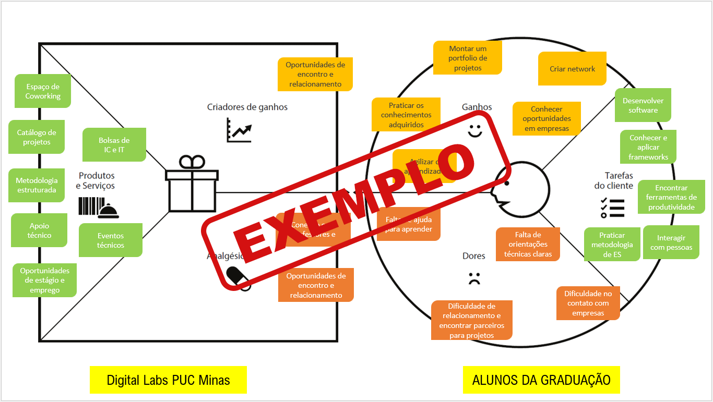
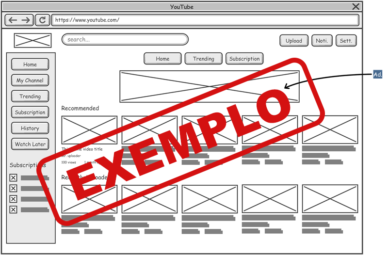
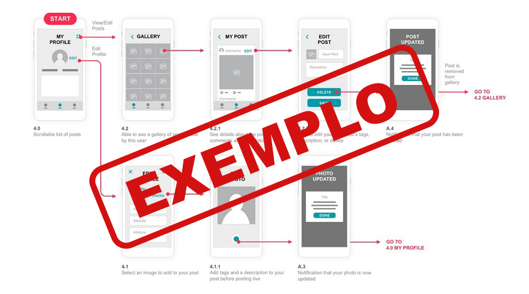

# Introdução

Informações básicas do projeto.

* **Projeto:** [NOME DO PROJETO]
* **Repositório GitHub:** [LINK PARA O REPOSITÓRIO NO GITHUB]
* **Membros da equipe:**

  * [Fulano](https://github.com/fulano) ⚠️ EXEMPLO ⚠️
  * [Beltrano](https://github.com/beltrano) ⚠️ EXEMPLO ⚠️
  * [Cicrano](https://github.com/cicrano) ⚠️ EXEMPLO ⚠️

Este documento acompanha a evolução do projeto ao longo das duas fases da disciplina: primeiro a fase de **Estratégia**, guiada pelo Design Thinking, em que entendemos o problema e projetamos a solução; depois a fase de **Implementação**, guiada pelo Scrum, em que construímos a aplicação ao longo de três sprints.

✅ [Template de Design Thinking (Miro)](https://miro.com/app/board/uXjVHy5TQHE=/) — duplique este board para conduzir com a sua equipe as etapas de Product Discovery e Product Design (Matriz CSD, Mapa de Stakeholders, Entrevistas, Personas, Ideação, Proposta de Valor etc.). Uma versão estática de exemplo também está disponível em [processo-dt.pdf](files/processo-dt.pdf).

## Sumário

1. [Contexto](#contexto)
   * [Problema](#problema) · [Objetivos](#objetivos) · [Justificativa](#justificativa) · [Público-Alvo](#público-alvo)
2. [Product Discovery](#product-discovery)
   * [Mapa de Stakeholders](#mapa-de-stakeholders) · [Matriz CSD](#matriz-csd) · [Pesquisa de Campo](#pesquisa-de-campo) · [Personas](#personas)
3. [Product Design](#product-design)
   * [Proposta de Valor](#proposta-de-valor) · [Histórias de Usuários](#histórias-de-usuários) · [Requisitos](#requisitos) · [User Story Map e Definição do MVP](#user-story-map-e-definição-do-mvp) · [Projeto de Interface](#projeto-de-interface)
4. [Metodologia](#metodologia)
   * [Ferramentas](#ferramentas) · [Gerenciamento do Projeto](#gerenciamento-do-projeto)
5. [Solução Implementada](#solução-implementada)
   * [Vídeo do Projeto](#vídeo-do-projeto) · [Funcionalidades](#funcionalidades) · [Minimundo](#minimundo) · [Estruturas de Dados](#estruturas-de-dados) · [Módulos e APIs](#módulos-e-apis)
6. [Referências](#referências)

---

# Contexto

Detalhes sobre o espaço de problema, os objetivos do projeto, sua justificativa e público-alvo.

## Problema

**✳️✳️✳️ COLOQUE AQUI O SEU TEXTO ✳️✳️✳️**

<details>
<summary>⚠️ Como preencher esta seção (apague antes de entregar)</summary>

Nesse momento você deve apresentar o problema que a sua aplicação deve resolver. No entanto, não é a hora de comentar sobre a aplicação. Descreva também o contexto em que essa aplicação será usada, se houver: empresa, tecnologias, etc. Novamente, descreva apenas o que de fato existir, pois ainda não é a hora de apresentar requisitos detalhados ou projetos.

**Orientações**:

- [Objetivos, Problema de pesquisa e Justificativa](https://medium.com/@versioparole/objetivos-problema-de-pesquisa-e-justificativa-c98c8233b9c3)
- [Matriz Certezas, Suposições e Dúvidas](https://medium.com/educa%C3%A7%C3%A3o-fora-da-caixa/matriz-certezas-suposi%C3%A7%C3%B5es-e-d%C3%BAvidas-fa2263633655)
- [Brainstorming](https://www.euax.com.br/2018/09/brainstorming/)

</details>

## Objetivos

**✳️✳️✳️ COLOQUE AQUI O SEU TEXTO ✳️✳️✳️**

<details>
<summary>⚠️ Como preencher esta seção (apague antes de entregar)</summary>

Aqui você deve descrever os objetivos do trabalho indicando que o objetivo geral é desenvolver um software para solucionar o problema apresentado acima. Apresente também alguns (pelo menos 2) objetivos específicos dependendo de onde você vai querer concentrar a sua prática investigativa, ou como você vai aprofundar no seu trabalho.

**Orientações**:

- [Objetivo geral e objetivo específico: como fazer e quais verbos utilizar](https://blog.mettzer.com/diferenca-entre-objetivo-geral-e-objetivo-especifico/)

</details>

## Justificativa

**✳️✳️✳️ COLOQUE AQUI O SEU TEXTO ✳️✳️✳️**

<details>
<summary>⚠️ Como preencher esta seção (apague antes de entregar)</summary>

Descreva a importância ou a motivação para trabalhar com esta aplicação que você escolheu. Indique as razões pelas quais você escolheu seus objetivos específicos ou as razões para aprofundar em certos aspectos do software.

O grupo de trabalho pode fazer uso de questionários, entrevistas e dados estatísticos, que podem ser apresentados, com o objetivo de esclarecer detalhes do problema que será abordado pelo grupo.

**Orientações**:

- [Como montar a justificativa](https://guiadamonografia.com.br/como-montar-justificativa-do-tcc/)

</details>

## Público-Alvo

**✳️✳️✳️ COLOQUE AQUI O SEU TEXTO ✳️✳️✳️**

<details>
<summary>⚠️ Como preencher esta seção (apague antes de entregar)</summary>

Descreva quais são as pessoas que usarão a sua aplicação indicando os diferentes perfis. A ideia é, dentro do possível, conhecer um pouco mais sobre o perfil dos usuários: conhecimentos prévios, relação com a tecnologia, relações hierárquicas, etc.

Adicione informações sobre o público-alvo por meio de uma descrição textual, ou diagramas de personas, mapa de stakeholders, ou como o grupo achar mais conveniente.

**Orientações**:

- [Público-alvo: o que é, tipos, como definir seu público e exemplos](https://klickpages.com.br/blog/publico-alvo-o-que-e/)
- [Qual a diferença entre público-alvo e persona?](https://rockcontent.com/blog/diferenca-publico-alvo-e-persona/)

</details>

---

# Product Discovery

Nesta etapa, aprofundamos a compreensão do problema escolhido a partir da perspectiva de quem o vivencia. O grupo levanta evidências de campo — não suposições — e as converte em artefatos que sustentam as decisões de produto tomadas na etapa de Product Design.

## Mapa de Stakeholders

**✳️✳️✳️ COLOQUE AQUI O SEU MAPA DE STAKEHOLDERS ✳️✳️✳️**

<details>
<summary>⚠️ Como preencher esta seção (apague antes de entregar)</summary>

O Mapa de Stakeholders identifica as pessoas e grupos que têm alguma relação com o problema: quem sofre com ele no dia a dia, quem decide sobre ele, quem pode ser entrevistado ou impactado pela solução. Esse mapa orienta quem o grupo deve procurar antes de partir para as entrevistas qualitativas.

</details>

## Matriz CSD

**✳️✳️✳️ COLOQUE AQUI A SUA MATRIZ CSD ✳️✳️✳️**

<details>
<summary>⚠️ Como preencher esta seção (apague antes de entregar)</summary>

A Matriz de Certezas, Suposições e Dúvidas organiza o que o grupo já sabe sobre o problema (certezas), o que está apenas supondo sem evidência (suposições) e o que ainda precisa ser descoberto (dúvidas). As suposições e dúvidas listadas aqui devem orientar o roteiro de entrevistas da pesquisa de campo.

**Orientações**:

- [Matriz Certezas, Suposições e Dúvidas](https://medium.com/educa%C3%A7%C3%A3o-fora-da-caixa/matriz-certezas-suposi%C3%A7%C3%B5es-e-d%C3%BAvidas-fa2263633655)

</details>

## Pesquisa de Campo

**✳️✳️✳️ APRESENTE O ROTEIRO DE ENTREVISTAS, OS ENTREVISTADOS E OS HIGHLIGHTS DA PESQUISA ✳️✳️✳️**

<details>
<summary>⚠️ Como preencher esta seção (apague antes de entregar)</summary>

Apresente o roteiro utilizado nas entrevistas qualitativas, a lista de pessoas entrevistadas (com perfil resumido) e os *highlights* de pesquisa — uma síntese das descobertas mais relevantes de cada entrevista, organizadas por tema ou por dúvida da Matriz CSD que foi respondida. É esse material, e não suposições da equipe, que deve fundamentar as personas a seguir.

</details>

## Personas

**✳️✳️✳️ APRESENTE OS DIAGRAMAS DE PERSONAS ✳️✳️✳️**

<details>
<summary>⚠️ Como preencher esta seção (apague antes de entregar)</summary>

Relacione as personas identificadas no seu projeto e os respectivos mapas de empatia. Lembre-se que você deve ser enumerar e descrever precisamente e de forma personalizada todos os principais envolvidos com a solução almeja.

**Orientações**:

- [Persona x Público-alvo](https://flammo.com.br/blog/persona-e-publico-alvo-qual-a-diferenca/)
- [O que é persona?](https://resultadosdigitais.com.br/blog/persona-o-que-e/)
- [Rock Content](https://rockcontent.com/blog/personas/)
- [Criar personas (Hotmart)](https://blog.hotmart.com/pt-br/como-criar-persona-negocio/)

</details>

---

# Product Design

Nesse momento, vamos transformar os insights e validações obtidos em soluções tangíveis e utilizáveis. Essa fase envolve a definição de uma proposta de valor, a redação das histórias de usuário, a organização de tudo em um User Story Map e a criação de wireframes, mockups e protótipos que detalham a interface e a experiência do usuário.

## Proposta de Valor

### Proposta para Persona XPTO ⚠️ EXEMPLO ⚠️



**✳️✳️✳️ APRESENTE O DIAGRAMA DA PROPOSTA DE VALOR PARA CADA PERSONA ✳️✳️✳️**

<details>
<summary>⚠️ Como preencher esta seção (apague antes de entregar)</summary>

O mapa da proposta de valor é uma ferramenta que nos ajuda a definir qual tipo de produto ou serviço melhor atende às personas definidas anteriormente.

</details>

## Histórias de Usuários

Com base na análise das personas foram identificadas as seguintes histórias de usuários:

| EU COMO...`PERSONA` | QUERO/PRECISO ...`FUNCIONALIDADE`        | PARA ...`MOTIVO/VALOR`               |
| --------------------- | ------------------------------------------ | -------------------------------------- |
| Usuário do sistema   | Registrar minhas tarefas ⚠️ EXEMPLO ⚠️ | Não esquecer de fazê-las             |
| Administrador         | Alterar permissões ⚠️ EXEMPLO ⚠️      | Permitir que possam administrar contas |

<details>
<summary>⚠️ Como preencher esta seção (apague antes de entregar)</summary>

Apresente aqui as histórias de usuário que são relevantes para o projeto de sua solução. As Histórias de Usuário consistem em uma ferramenta poderosa para a compreensão e elicitação dos requisitos funcionais e não funcionais da sua aplicação. Se possível, agrupe as histórias de usuário por contexto, para facilitar consultas recorrentes à essa parte do documento.

**Orientações**:

- [Histórias de usuários com exemplos e template](https://www.atlassian.com/br/agile/project-management/user-stories)
- [Como escrever boas histórias de usuário (User Stories)](https://medium.com/vertice/como-escrever-boas-users-stories-hist%C3%B3rias-de-usu%C3%A1rios-b29c75043fac)

</details>

## Requisitos

As tabelas que se seguem apresentam os requisitos funcionais e não funcionais que detalham o escopo do projeto.

### Requisitos Funcionais

| ID     | Descrição do Requisito                                   | Prioridade |
| ------ | ---------------------------------------------------------- | ---------- |
| RF-001 | Permitir que o usuário cadastre tarefas ⚠️ EXEMPLO ⚠️ | ALTA       |
| RF-002 | Emitir um relatório de tarefas no mês ⚠️ EXEMPLO ⚠️ | MÉDIA     |

### Requisitos não Funcionais

| ID      | Descrição do Requisito                                                              | Prioridade |
| ------- | ------------------------------------------------------------------------------------- | ---------- |
| RNF-001 | O sistema deve ser responsivo para rodar em um dispositivos móvel ⚠️ EXEMPLO ⚠️ | MÉDIA     |
| RNF-002 | Deve processar requisições do usuário em no máximo 3s ⚠️ EXEMPLO ⚠️          | BAIXA      |

<details>
<summary>⚠️ Como preencher esta seção (apague antes de entregar)</summary>

Os requisitos de um projeto são classificados em dois grupos:

- [Requisitos Funcionais (RF)](https://pt.wikipedia.org/wiki/Requisito_funcional): correspondem a uma funcionalidade que deve estar presente na plataforma (ex: cadastro de usuário).
- [Requisitos Não Funcionais (RNF)](https://pt.wikipedia.org/wiki/Requisito_n%C3%A3o_funcional): correspondem a uma característica técnica, seja de usabilidade, desempenho, confiabilidade, segurança ou outro (ex: suporte a dispositivos iOS e Android).

Lembre-se que cada requisito deve corresponder à uma e somente uma característica alvo da sua solução. Além disso, certifique-se de que todos os aspectos capturados nas Histórias de Usuário foram cobertos.

**Orientações**:

- [O que são Requisitos Funcionais e Requisitos Não Funcionais?](https://codificar.com.br/requisitos-funcionais-nao-funcionais/)
- [O que são requisitos funcionais e requisitos não funcionais?](https://analisederequisitos.com.br/requisitos-funcionais-e-requisitos-nao-funcionais-o-que-sao/)

</details>

## User Story Map e Definição do MVP

**✳️✳️✳️ COLOQUE AQUI O SEU USER STORY MAP ✳️✳️✳️**

<details>
<summary>⚠️ Como preencher esta seção (apague antes de entregar)</summary>

O User Story Map organiza todas as histórias de usuário em uma visão única do produto, ordenadas pela jornada do usuário (linha) e pela prioridade (coluna). É a partir dele que o grupo recorta o Produto Mínimo Viável (MVP) e distribui o restante do backlog entre as três sprints da fase de Implementação.

Indique claramente, no seu User Story Map: (1) quais histórias compõem o MVP; (2) em qual sprint (1, 2 ou 3) cada fatia do backlog será desenvolvida.

**Orientações**:

- [User Story Mapping: o que é e como fazer](https://www.atlassian.com/br/agile/project-management/user-story-mapping)

</details>

## Projeto de Interface

Artefatos relacionados com a interface e a interacão do usuário na proposta de solução.

### Wireframes

Estes são os protótipos de telas do sistema.

#### TELA XPTO ⚠️ EXEMPLO ⚠️

Descrição para a tela XPTO



**✳️✳️✳️ COLOQUE AQUI OS PROTÓTIPOS DE TELAS COM TÍTULO E DESCRIÇÃO ✳️✳️✳️**

<details>
<summary>⚠️ Como preencher esta seção (apague antes de entregar)</summary>

Wireframes são protótipos das telas da aplicação usados em design de interface para sugerir a estrutura de um site web e seu relacionamentos entre suas páginas. Um wireframe web é uma ilustração semelhante ao layout de elementos fundamentais na interface.

**Orientações**:

- [Ferramentas de Wireframes](https://rockcontent.com/blog/wireframes/)
- [Figma](https://www.figma.com/)
- [Adobe XD](https://www.adobe.com/br/products/xd.html#scroll)
- [MarvelApp](https://marvelapp.com/developers/documentation/tutorials/)

</details>

### User Flow



**✳️✳️✳️ COLOQUE AQUI O DIAGRAMA DE FLUXO DE TELAS ✳️✳️✳️**

<details>
<summary>⚠️ Como preencher esta seção (apague antes de entregar)</summary>

Fluxo de usuário (User Flow) é uma técnica que permite ao desenvolvedor mapear todo fluxo de telas do site ou app. Essa técnica funciona para alinhar os caminhos e as possíveis ações que o usuário pode fazer junto com os membros de sua equipe.

**Orientações**:

- [User Flow: O Quê É e Como Fazer?](https://medium.com/7bits/fluxo-de-usu%C3%A1rio-user-flow-o-que-%C3%A9-como-fazer-79d965872534)
- [User Flow vs Site Maps](http://designr.com.br/sitemap-e-user-flow-quais-as-diferencas-e-quando-usar-cada-um/)
- [Top 25 User Flow Tools &amp; Templates for Smooth](https://www.mockplus.com/blog/post/user-flow-tools)

</details>

### Protótipo Interativo

✅ [Protótipo Interativo (MarvelApp)](https://marvelapp.com/prototype/4hd6091?emb=1&iosapp=false&frameless=false)  ⚠️ EXEMPLO ⚠️

**✳️✳️✳️ COLOQUE AQUI UM IFRAME COM SEU PROTÓTIPO INTERATIVO ✳️✳️✳️**

<details>
<summary>⚠️ Como preencher esta seção (apague antes de entregar)</summary>

Um protótipo interativo apresenta o projeto de interfaces e permite ao usuário navegar pelas funcionalidades como se estivesse lidando com o software pronto. Utilize as mesmas ferramentas de construção de wireframes para montagem do seu protótipo interativo. Inclua o link para o protótipo interativo do projeto.

</details>

---

# Metodologia

Detalhes sobre a organização do grupo e o ferramental empregado.

## Ferramentas

Relação de ferramentas empregadas pelo grupo durante o projeto.

| Ambiente                    | Plataforma | Link de acesso                                     |
| --------------------------- | ---------- | -------------------------------------------------- |
| Processo de Design Thinking | Miro       | https://miro.com/XXXXXXX ⚠️ EXEMPLO ⚠️        |
| Repositório de código     | GitHub     | https://github.com/XXXXXXX ⚠️ EXEMPLO ⚠️      |
| Hospedagem do site          | Render     | https://site.render.com/XXXXXXX ⚠️ EXEMPLO ⚠️ |
| Protótipo Interativo       | MarvelApp  | https://marvelapp.com/XXXXXXX ⚠️ EXEMPLO ⚠️   |

<details>
<summary>⚠️ Como preencher esta seção (apague antes de entregar)</summary>

Liste as ferramentas empregadas no desenvolvimento do projeto, justificando a escolha delas, sempre que possível. Inclua itens como: (1) editor de código, (2) ferramentas de comunicação, (3) ferramentas de diagramação, (4) plataformas de hospedagem, entre outras.

</details>

## Gerenciamento do Projeto

Divisão de papéis no grupo e apresentação da estrutura da ferramenta de controle de tarefas (Kanban), utilizada para acompanhar o backlog do produto e o andamento das três sprints.


<details>
<summary>⚠️ Como preencher esta seção (apague antes de entregar)</summary>

Nesta parte do documento, você deve apresentar o processo de trabalho baseado nas metodologias ágeis, a divisão de papéis e tarefas, as ferramentas empregadas e como foi realizada a gestão de configuração do projeto via GitHub.

Coloque detalhes sobre o processo de Design Thinking e a implementação do Framework Scrum seguido pelo grupo. O grupo poderá fazer uso de ferramentas on-line para acompanhar o andamento do projeto, a execução das tarefas e o status de desenvolvimento da solução.

**Orientações**:

- [Sobre Projects - GitHub Docs](https://docs.github.com/pt/issues/planning-and-tracking-with-projects/learning-about-projects/about-projects)
- [Gestão de projetos com GitHub | balta.io](https://balta.io/blog/gestao-de-projetos-com-github)
- [(460) GitHub Projects - YouTube](https://www.youtube.com/playlist?list=PLiO7XHcmTsldZR93nkTFmmWbCEVF_8F5H)
- [11 Passos Essenciais para Implantar Scrum no seu Projeto](https://mindmaster.com.br/scrum-11-passos/)
- [Scrum em 9 minutos](https://www.youtube.com/watch?v=XfvQWnRgxG0)

</details>

---

# Solução Implementada

Esta seção apresenta todos os detalhes da solução criada no projeto.

## Vídeo do Projeto

O vídeo a seguir traz uma apresentação do problema que a equipe está tratando e a proposta de solução. ⚠️ EXEMPLO ⚠️

[](https://www.youtube.com/embed/70gGoFyGeqQ)

<details>
<summary>⚠️ Como preencher esta seção (apague antes de entregar)</summary>

O vídeo de apresentação é voltado para que o público externo possa conhecer a solução. O formato é livre, sendo importante que seja apresentado o problema e a solução numa linguagem descomplicada e direta. Inclua um link para o vídeo do projeto.

</details>

## Funcionalidades

Esta seção apresenta as funcionalidades da solução.

### Funcionalidade 1 - Cadastro de Contatos ⚠️ EXEMPLO ⚠️

Permite a inclusão, leitura, alteração e exclusão de contatos para o sistema

* **Estrutura de dados:** Contatos
* **Instruções de acesso:**
  * Abra o site e efetue o login
  * Acesse o menu principal e escolha a opção Cadastros
  * Em seguida, escolha a opção Contatos
* **Tela da funcionalidade**:


<details>
<summary>⚠️ Como preencher esta seção (apague antes de entregar)</summary>

Apresente cada uma das funcionalidades que a aplicação fornece tanto para os usuários quanto aos administradores da solução.

Inclua, para cada funcionalidade, itens como: (1) título e descrição da funcionalidade; (2) estrutura de dados associada; (3) instruções de acesso e uso.

</details>

## Minimundo

**✳️✳️✳️ DESCREVA AQUI O MINIMUNDO DO SEU NEGÓCIO ✳️✳️✳️**

<details>
<summary>⚠️ Como preencher esta seção (apague antes de entregar)</summary>

O minimundo é uma descrição textual do negócio por trás da sua aplicação: quais são as principais entidades envolvidas (por exemplo, usuários, produtos, pedidos), como elas se relacionam entre si e quais regras de negócio existem. É a partir dessa descrição que o grupo desenha o modelo de dados apresentado na seção seguinte.

</details>

## Estruturas de Dados

Descrição das estruturas de dados utilizadas na solução, com exemplos no formato JSON. No projeto, os dados ficam armazenados no arquivo `codigo/db/db.json` e são servidos automaticamente pelo **JSON Server**: cada chave de nível superior desse arquivo vira uma coleção com sua própria API RESTful (`GET`, `POST`, `PUT`, `DELETE`), sem que seja necessário programar um banco de dados à parte.

### Estrutura de Dados - Contatos ⚠️ EXEMPLO ⚠️

Contatos da aplicação

```json
{
  "id": 1,
  "nome": "Leanne Graham",
  "cidade": "Belo Horizonte",
  "categoria": "amigos",
  "email": "Sincere@april.biz",
  "telefone": "1-770-736-8031",
  "website": "hildegard.org"
}
```

### Estrutura de Dados - Usuários ⚠️ EXEMPLO ⚠️

Registro dos usuários do sistema, utilizado para login e para o perfil do sistema

```json
{
  "id": 1,
  "login": "admin",
  "senha": "123",
  "nome": "Administrador do Sistema",
  "email": "admin@abc.com"
}
```

<details>
<summary>⚠️ Como preencher esta seção (apague antes de entregar)</summary>

Apresente as estruturas de dados utilizadas na solução, tanto para os dados que fazem parte da essência da aplicação quanto outras estruturas criadas para algum tipo de configuração. Nomeie a estrutura, coloque uma descrição sucinta e apresente um exemplo em formato JSON correspondente a uma das coleções do `db.json`.

**Orientações:**

- [JSON Introduction](https://www.w3schools.com/js/js_json_intro.asp)
- [Trabalhando com JSON - Aprendendo desenvolvimento web | MDN](https://developer.mozilla.org/pt-BR/docs/Learn/JavaScript/Objects/JSON)

</details>

## Módulos e APIs

Esta seção apresenta os módulos e APIs utilizados na solução.

**Images**:

* Unsplash - [https://unsplash.com/](https://unsplash.com/) ⚠️ EXEMPLO ⚠️

**Fonts:**

* Icons Font Face - [https://fontawesome.com/](https://fontawesome.com/) ⚠️ EXEMPLO ⚠️

**Scripts:**

* jQuery - [http://www.jquery.com/](http://www.jquery.com/) ⚠️ EXEMPLO ⚠️
* Bootstrap 4 - [http://getbootstrap.com/](http://getbootstrap.com/) ⚠️ EXEMPLO ⚠️

<details>
<summary>⚠️ Como preencher esta seção (apague antes de entregar)</summary>

Apresente os módulos e APIs utilizados no desenvolvimento da solução. Inclua itens como: (1) frameworks, bibliotecas, módulos, etc. utilizados no desenvolvimento da solução; (2) APIs utilizadas para acesso a dados, serviços, etc.

</details>

---

# Referências

As referências utilizadas no trabalho foram:

* SOBRENOME, Nome do autor. Título da obra. 8. ed. Cidade: Editora, 2000. 287 p ⚠️ EXEMPLO ⚠️

<details>
<summary>⚠️ Como preencher esta seção (apague antes de entregar)</summary>

Inclua todas as referências (livros, artigos, sites, etc.) utilizados no desenvolvimento do trabalho.

**Orientações**:

- [Formato ABNT](https://www.normastecnicas.com/abnt/trabalhos-academicos/referencias/)
- [Referências Bibliográficas da ABNT](https://comunidade.rockcontent.com/referencia-bibliografica-abnt/)

</details>
